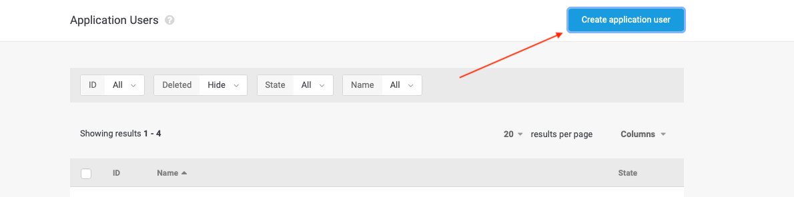
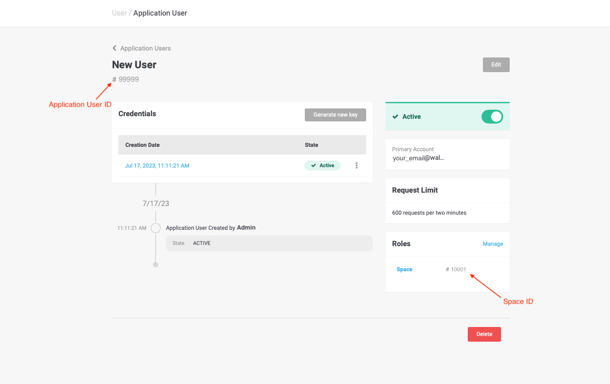
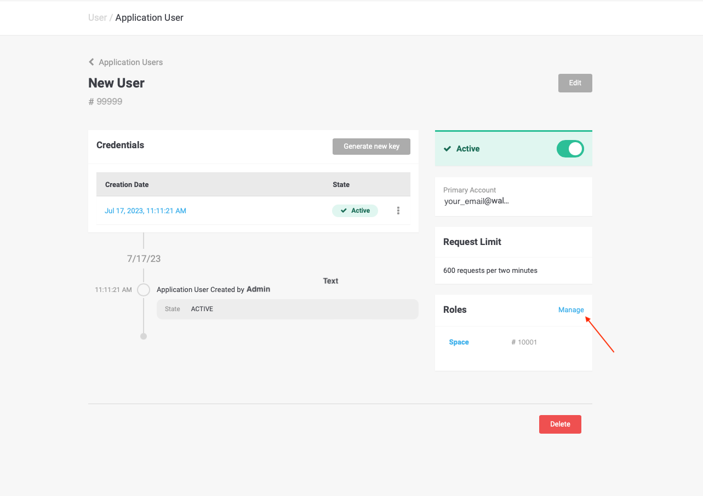
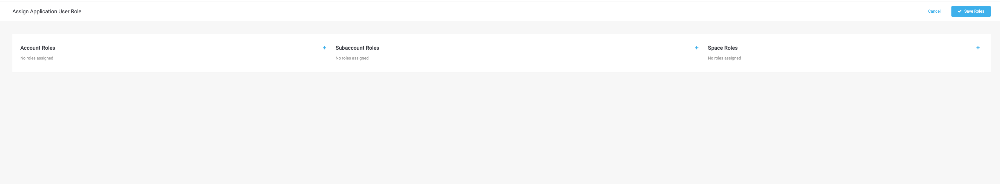

# MSDK-demo-ios-app

# Wallee Payment SDK

Online Shop is an IOS SwiftUI application intended to showcase he integration of Wallee Payment SDK.


## Running this project

### Requirements

- Xcode 12 or above
- Wallee account

### Set up Wallee

To use the iOS Payment SDK, you need a [wallee account](https://app-wallee.com/user/signup). After signing up, set up your space and enable the payment methods you would like to support.

### Project Setup

In order to run the project on you local machine, please do the following steps:

1. install [Xcode](https://developer.apple.com/xcode/).
2. install [Cocoapods](https://cocoapods.org/) by running `brew install cocoapods`.
3. clone the repository and cd into it's directory
4. run `pod install`
5. run the project with xCode

## Authentication into the app

In order to login into the application you will need the following information:

- Space ID
- Application User ID
- Token
  

To get all the needed credentials for authentication, please follow the steps:

1. create an account on [Wallee portal](https://app-wallee.com/user/signup) if you don't have any
2. go to [Account > Users > Application Users](https://app-wallee.com/account/select?target=/user/application/list) and select the account you would like to use
3. on the side menu sleect Application users
   
4. create a new application user, after doing it, the user’s ID and authentication key will be shown to you. Please be aware, that once you close the dialog or browser window, you will not be able to see the authentication key again. So make sure to write it down.
   
   
5. paste the Authentication key value into Token field of the app
6. copy the Application User ID and Space ID into the app as shown on the screenshot
   
7. now let's assign the role to the Application user. To do so click Manage as shown on screenshot and select the preferred role
   
   

## Integration of the SDK

### API reference

| API                                                                           | Type      | Description                                                                                                                                                                     |
| ----------------------------------------------------------------------------- | --------- | ------------------------------------------------------------------------------------------------------------------------------------------------------------------------------- |
| WalleePaymentResultObserver                                                   | protocol  | Protocol for handling post-payment events `paymentResult`                                                                                                                       |
| `func paymentResult(paymentResultMessage: PaymentResult)`                     | function  | Result handler for transaction state                                                                                                                                            |
| `func launchPayment(token: String, rootController: UIViewController)`         | function  | Opening payment dialog (activity)                                                                                                                                               |
| `func setDarkTheme(dark: NSMutableDictionary)`                                | function  | Can override the whole dark theme or just some specific color.                                                                                                                  |
| `func setLightTheme(light: NSMutableDictionary)`                              | function  | Can override the whole light theme or just some specific color.                                                                                                                 |
| `func setCustomTheme(custom: NSMutableDictionary/nill, baseTheme: ThemeEnum)` | function  | Force to use only this theme (independent on user's setup). Can override default light/dark theme and force to use it or completely replace all or specific colors (DARK/LIGHT) |
| `func presentModalView(isPresented: Bool, token: String)`                     | extension | SwiftUI View modifier to present the UI part of the Payment SDK                                                                                                                 |

### Configuration

Import the SDK to your app as [Cocoapod](https://cocoapods.org/)

`pod ‘WalleePaymentSdk’, 'versionPlaceholder' :source=> ‘https://github.com/WhiteLabelGithubOwnerName/ios-mobile-sdk-spec.git’`

```sh
target 'DemoApp' do
  # Comment the next line if you don't want to use dynamic frameworks
  use_frameworks!

  pod ‘WalleePaymentSdk’, 'versionPlaceholder' :source=> ‘https://github.com/WhiteLabelGithubOwnerName/ios-mobile-sdk-spec.git’`
  target 'DemoAppTests' do
    inherit! :search_paths
  end

end
```

### Create transaction

For security reasons, your app cannot create transactions and fetch access tokens. This has to be done on your server by talking to the [wallee Web Service API](https://app-wallee.com/en-us/doc/api/web-service). You can use one of the official SDK libraries to make these calls.

To use the iOS Payment SDK to collect payments, an endpoint needs to be added on your server that creates a transaction by calling the [create transaction](https://app-wallee.com/doc/api/web-service#transaction-service--create) API endpoint. A transaction holds information about the customer and the line items and tracks charge attempts and the payment state.

Once the transaction has been created, your endpoint can fetch an access token by calling the [create transaction credentials](https://app-wallee.com/doc/api/web-service#transaction-service--create-transaction-credentials) API endpoint. The access token is returned and passed to the iOS Payment SDK.

```bash
# Create a transaction
curl 'https://app-wallee.com/api/transaction/create?spaceId=1' \
  -X "POST" \
  -d "{{TRANSACTION_DATA}}"

# Fetch an access token for the created transaction
curl 'https://app-wallee.com/api/transaction/createTransactionCredentials?spaceId={{SPACE_ID}}&id={{TRANSACTION_ID}}' \
  -X 'POST'
```

#### SwiftUI Implementation

First of all make sure you import the `WalleePaymentSdk` package and initialize it in relevant class. You also need to extend the class with `WalleePaymentResultObserver` to able to receive the result of payment:

```swift
// PaymentManager.swift
import WalleePaymentSdk
...
class PaymentManager: WalleePaymentResultObserver {
...
func onOpenSdkPress(){
    let wallee = WalleePaymentSdk(eventObserver: self)
    ...
    }
}
```

To display the UI of Payment SDK make sure you import the `WalleePaymentSdk` into the relevant View:

```swift
// ContentView.swift
import WalleePaymentSdk
...
    Button {
       // add code for generating transaction and fetching the token
       isModalPresented = true
    } label: {
        Text("Checkout")
    }
    .presentModalView(isPresented: isModalPresented, token: token)
```

Use presentModalView custom modifier for the UI part, passing two arguments: `isPresented` (modal presented state) and `token`.

### Handle result

The response object contains these properties:

- `code` describing the result's type.

| Code        | Description                                                   |
| ----------- | ------------------------------------------------------------- |
| `COMPLETED` | The payment was successful.                                   |
| `FAILED`    | The payment failed. Check the `message` for more information. |
| `CANCELED`  | The customer canceled the payment.                            |

- `message` providing a localized error message that can be shown to the customer.

```swift
import WalleePaymentSdk
...

class PaymentManager: ObservableObject, WalleePaymentResultObserver {
...
func paymentResult(paymentResultMessage: PaymentResult) {
        print("PAYMENT RESULT: ", paymentResultMessage.code)
        self.resultCallback = paymentResultMessage.code.rawValue
        ...
    }
}
```

### Verify payment

As customers could quit the app or lose network connection before the result is handled or malicious clients could manipulate the response, it is strongly recommended to set up your server to listen for webhook events the get transactions' actual states. Find more information in the [webhook documentation](https://app-wallee.com/en-us/doc/webhooks).

## Theming

The appearance of the payment dialog can be customized to match the look and feel of your app. This can be done for both the light and dark theme individually.

Colors can be modified by passing a JSON object to the `WalleePaymentSdk` instance. You can either completely override the theme or only change certain colors.

- `walleePaymentSdk.setLightTheme(NSMutableDictionary)` allows to modify the payment dialog's light theme.
- `walleePaymentSdk.setDarkTheme(NSMutableDictionary)` allows to modify the payment dialog's dark theme.
- `walleePaymentSdk.setCustomTheme(NSMutableDictionary|| nil, ThemeEnum)` allows to enforce a specific theme (dark, light or your own).

```swift
import WalleePaymentSdk
...
    let walleePaymentSdk = WalleePaymentSdk (eventObserver: self)

    func openSdkClick()
    {
        ....
        changeColorSchema(wallee: wallee)
        ...
    }

    private func changeColorSchema(wallee: WalleePaymentSdk)
    {
        walleePaymentSdk.setLightTheme(light: getLightTheme())
    }
```

This overrides the colors `colorBackground`, `colorText`, `colorHeadingText` and `colorError` for both the dark and light theme.

The `changeColorSchema` function allows to define the theme to be used by the payment dialog and prevent it from switching themes based on the user's settings. This way e.g. high-contrast and low-contrast themes can be added. The logic for switching between these themes is up to you though.

You can also use `setCustomTheme` to force the usage of the light or dark theme.

```swift
walleePaymentSdk.setCustomTheme(custom: getNewCustomTheme(), baseTheme: .DARK)
```

```swift
walleePaymentSdk.setCustomTheme(custom: getNewCustomTheme(), baseTheme: .LIGHT)
```
